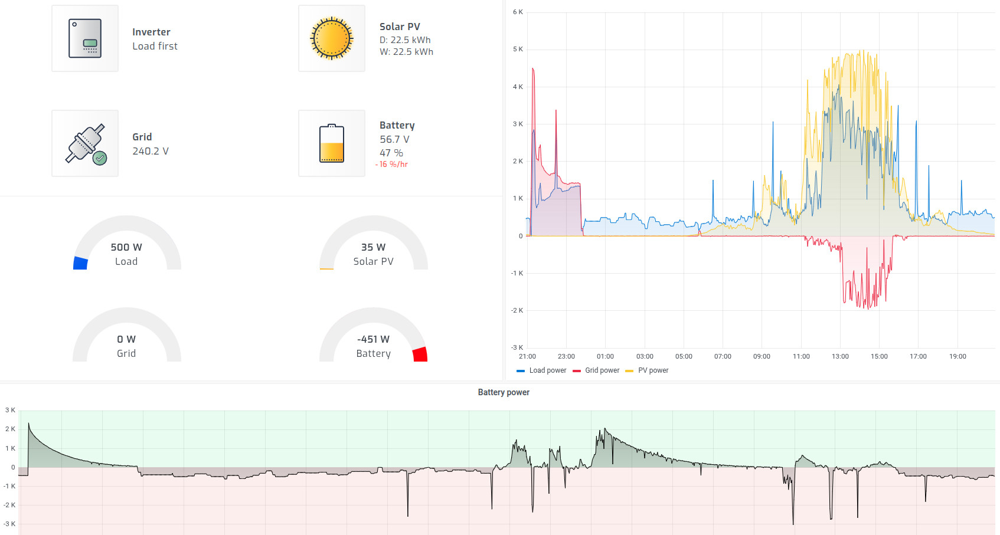

# DIY Solar Battery

## Description
Repurposing a used 20kWh Nissian Leaf battery into a Solar battery
 

## Costs

## Deconstruction
[!WARNING]
**Deadly** DC Voltages are involded with decostructing an EV battery. Proceed at your own risk.

## Reconstruction
Battery module configuration - 14S6P

## Inverter
[Growatt SPH6000 TL BL UP](https://s.click.aliexpress.com/e/_c4V2mrlf)

[RJ45 To Screw Terminal Adaptor RJ45 Male](https://s.click.aliexpress.com/e/_c352MJSZ)

[Metal Film Resistors Kit 300Pc](https://s.click.aliexpress.com/e/_c4ckVkhL)

[PVC Single-Core Multi-Strand Power Cables, 25mm2, 5M](https://s.click.aliexpress.com/e/_c3MwGd3T)

## Monitoring
[USB RS485](https://s.click.aliexpress.com/e/_c3fc73Fb)

[Solar Assistant](https://solar-assistant.io/)
