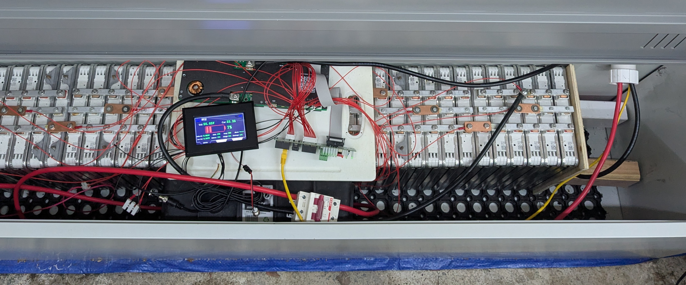
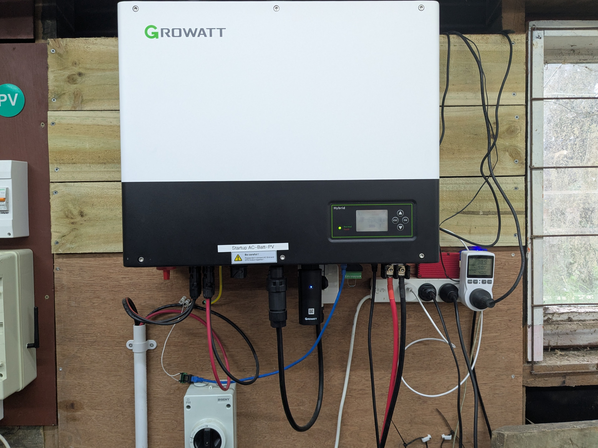
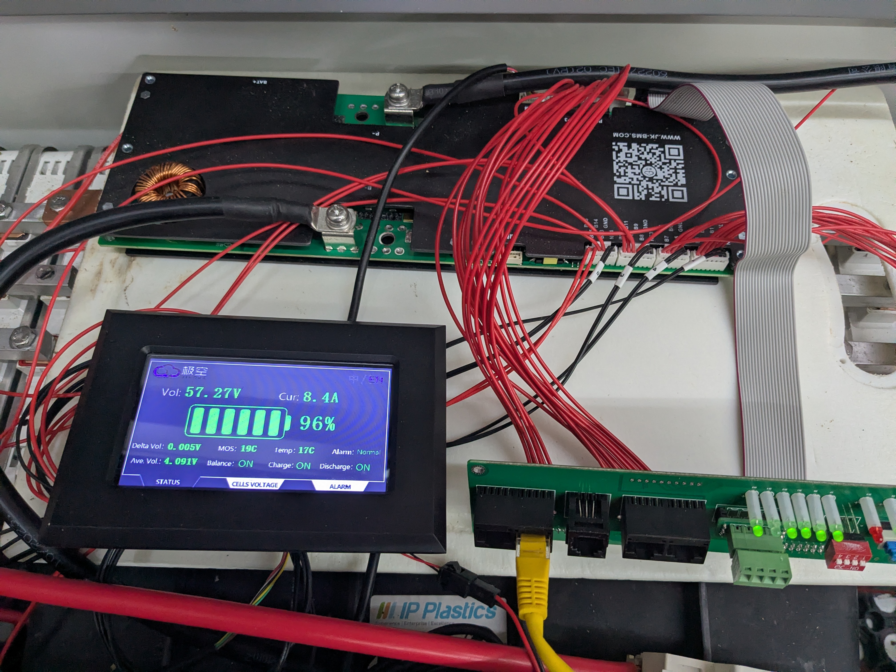
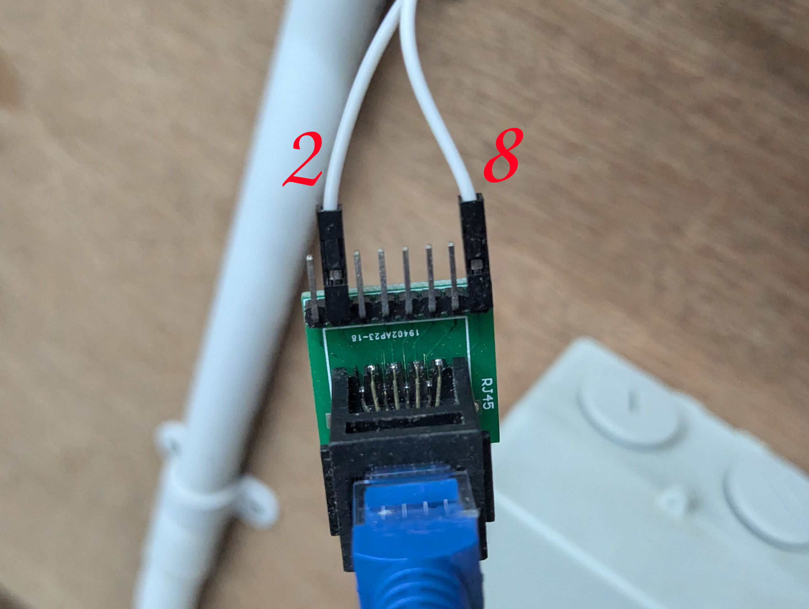
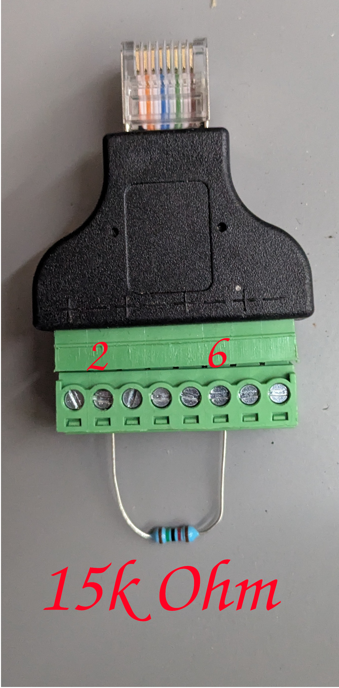
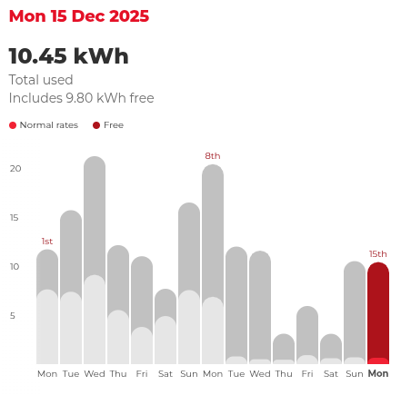
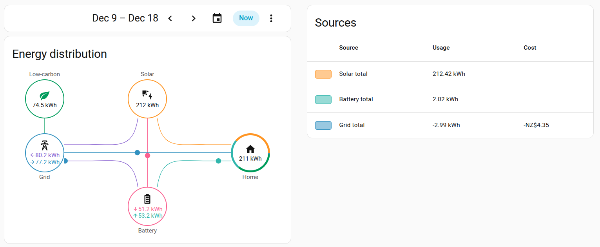

# DIY Solar Battery

## Overview
Repurposing a used Nissan Leaf 24 kWh battery pack into a home solar-storage system. This document outlines pack deconstruction, module testing, reassembly into a 14S6P pack (~48–58 V DC), BMS and inverter integration, monitoring, and parts used.

This project is intended for experienced DIYers. High-voltage DC is hazardous — use appropriate PPE and only proceed if you are qualified.

## Quick Facts
- Nominal pack configuration: 14S6P (~48–58 V DC)
- Approximate usable capacity: ~14 kWh (pack dependent)
- Modules: 48 modules (each module = 2 cells in series)

## Estimated Costs
- Leaf battery (used): ~NZ$3,000
- BMS (model-dependent): ~NZ$300
- Misc (cables, breakers, connectors): ~NZ$300
- Estimated total: ~NZ$3,600–3,800 (project-dependent)

## Safety Warning
**WARNING — High DC voltages present.** Deconstructing or modifying EV battery packs is dangerous and can be fatal. Only work on these systems if you have the skills, tools, and PPE. Isolate circuits, verify zero voltage before touching, and follow local electrical regulations.

## Deconstruction
Save all high-current busbars, copper connectors and fasteners for reuse. 

## Module Testing
- Modules: 48 (each module = 2 cells in series)
- Test voltage range: 8.4 V (charged) down to ~6.3 V (discharged)
- Test/discharge current used: 10 A

Observed results (example):
- ≈333 Wh per module
- ≈16 kWh total raw capacity across modules (before pack reconfiguration and losses)
- SoH ~66.67%

## Reconstruction (Pack Assembly)
- Target configuration: 14S6P (~48–58 V DC)
- Estimated usable capacity after assembly: ~14 kWh

Key notes:
- Verify correct series/parallel wiring and use clear labelling.
- Fit appropriate DC breakers/contactors on the pack main.
- Ensure insulation, strain relief, and proper crimping for high-current conductors.
- Perform balancing, insulation-resistance (megger) checks and low-current verification before applying full charge.
- Keep spare modules for future replacement or testing.

## Inverter
### Growatt SPH6000 TL BL UP (Hybrid)
Converts DC to AC and manages battery charging/discharging.

Parts example:
[Growatt SPH6000 TL BL UP](https://s.click.aliexpress.com/e/_c4V2mrlf)

Configuration notes:
- I used a conservative battery voltage window (49–57 V) for safety.
- If lithium communication/profiles are not available, some installers use the lead-acid profile with care — verify inverter behaviour and limits before leaving the system unattended.

## Battery Management System (BMS)
### JK-PB1A16S10P
Monitors cell voltages, balances cells, and provides protections and contactor control.

Parts example:
[JK-PB1A16S10P](https://s.click.aliexpress.com/e/_c3MiGCWl)

Notes:
- Verify RS485 wiring and BMS firmware/configuration for your pack topology.
- Test balancing and alarm thresholds on a bench before connecting the full pack.

### CT Clamp (Power Measurement)
Used to measure import/export current for the inverter.

Parts:
- [RJ45 Breakout Female](https://s.click.aliexpress.com/e/_c2yWUT9P)
- [CT Clamp OPCT16AL 50A-25mA](https://s.click.aliexpress.com/e/_c4NxAtsz)

Mounting note: place the CT on the mains feed to the inverter per the inverter manual; observe phase orientation and CT rating.

### Dummy NTC (if required)
Some inverters expect an NTC input to enable certain battery profiles. Use the correct resistor/thermistor equivalent only if you understand the inverter's requirements.

Parts (examples):
- [RJ45 to screw terminal adaptor](https://s.click.aliexpress.com/e/_c352MJSZ)
- Resistors kit (for building a dummy NTC if necessary)

## Wiring & Misc
- Cables: use appropriately rated multi-strand power cables (e.g., 25 mm² where required).
- Tools/Safety: insulated tools, PPE, correct-rated fuses/breakers, crimping tools, heatshrink.

## Monitoring
### RS485 wiring (examples)
RS485 pinouts used in this project (T568B RJ45 pin colours shown):

- Inverter -> RPi (example):
	- Blue/White -> A
	- Blue -> B

- BMS -> RPi (example):
	- Orange -> A
	- Orange/White -> B

Parts:
- [USB RS485 adapter](https://s.click.aliexpress.com/e/_c3srqCLT)

### Software
- Solar Assistant: poll inverter and BMS registers and forward metrics (MQTT/DB) to Home Assistant or other systems. See Solar Assistant docs for device templates.
- Home Assistant: use the Energy Dashboard to visualise production, consumption and battery state.

## Results (Example)
Battery was enabled on Tuesday 9 December. After enabling the battery and configuring inverter charging during free-tariff periods, purchased-grid energy dropped significantly in the observed week.

With exported energy rates considered, the system produced a modest profit over ~10 days of sunny weather in this example — results will vary widely by location, tariffs and battery condition.

## Conclusion
Is it worth it?

It depends on the battery condition, purchase price and your local electricity tariffs. In my case I ended up with a ~14 kWh system (6 spare modules) for roughly NZ$3,700, which can be competitive with lower-end commercial battery offerings if you source a good pack.
