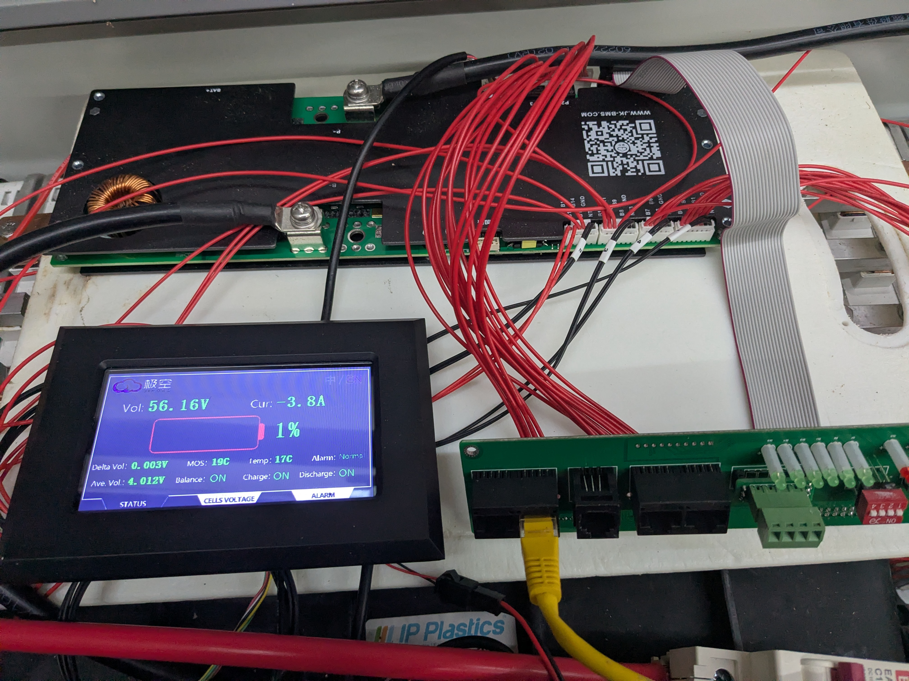

# DIY Solar Battery

## Description
Repurposing a used 20 kWh Nissan Leaf battery into a solar battery
 

## Costs

## Deconstruction
[!WARNING]
**WARNING — High DC voltages present.** Deconstructing an EV battery is extremely dangerous and can be fatal. Only perform this work if you are experienced with high-voltage systems, have appropriate personal protective equipment (PPE), and follow proper isolation and safety procedures.

## Reconstruction
Battery module configuration - 14S6P ~48V-58V DC

## Inverter
### SPH6000 TL BL UP - Hybrid Inverter
#### Converts DC from the panels into AC for the grid/load and also manages battery charge/discharge

##### Parts
[Growatt SPH6000 TL BL UP](https://s.click.aliexpress.com/e/_c4V2mrlf)

## Battery Management System (BMS)
### JK-PB1A16S10P
#### Manages safety and health parameters of the battery

##### Parts
[JK-PB1A16S10P](https://s.click.aliexpress.com/e/_c3MiGCWl)

### CT Clamp
#### Measures grid Import/Export power

##### Parts
- [RJ45 Breakout Female](https://s.click.aliexpress.com/e/_c2yWUT9P)
- [CT Clamp OPCT16AL 50A-25mA](https://s.click.aliexpress.com/e/_c4NxAtsz)

### Dummy NTC thermistor
#### Used to allow lead-acid mode on the inverter

##### Parts
- [RJ45 To Screw Terminal Adaptor RJ45 Male](https://s.click.aliexpress.com/e/_c352MJSZ)
- [Metal Film Resistors Kit 300Pc](https://s.click.aliexpress.com/e/_c4ckVkhL)

### Misc
[PVC Single-Core Multi-Strand Power Cables, 25mm2, 5M](https://s.click.aliexpress.com/e/_c3MwGd3T)

## Monitoring
### RS485 Inverter -> RPi
T568B:
- Blue/White -> A 
- Blue -> B

-port.png)

### RS485 BMS -> RPi
T568B:
- Orange -> A
- Orange/White -> B

##### Parts
[USB RS485](https://s.click.aliexpress.com/e/_c3fc73Fb)

### Solar Assistant
#### Communicates with the Inverter and BMS 
[Solar Assistant](https://solar-assistant.io/)

### Home Assistant
#### Home automation platform with an excellent Energy Dashboard
[Home Assistant](https://www.home-assistant.io/)
