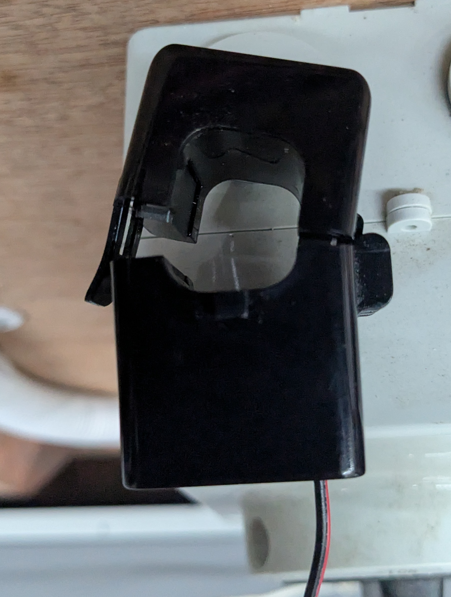
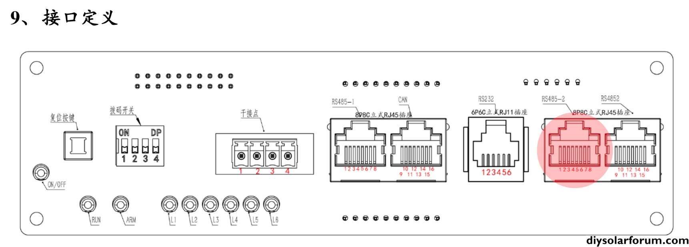
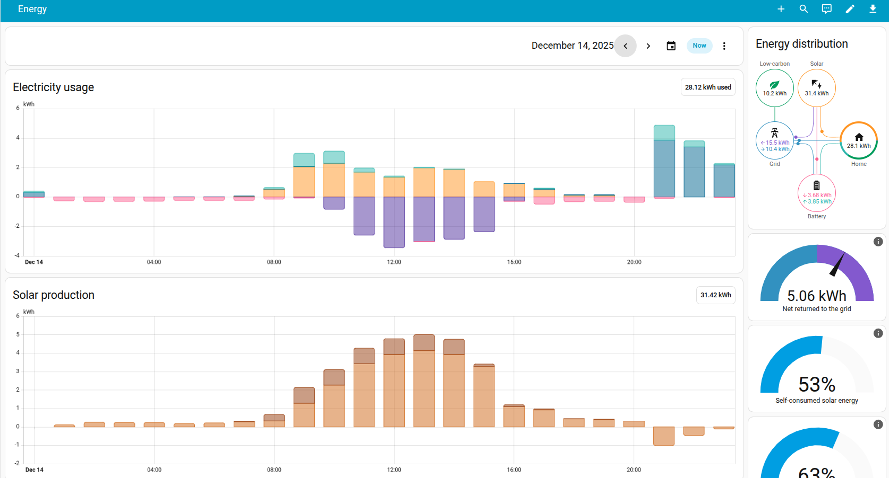

# DIY Solar Battery

## Description
This repository documents repurposing a used 20 kWh Nissan Leaf battery pack into a home solar storage system.

It covers safe deconstruction and reassembly of the pack, module reconfiguration (14S6P ≈ 48–58 V DC), wiring and integration of a Battery Management System (JK-PB1A16S10P), inverter setup (Growatt SPH6000 TL BL UP), monitoring via RS485 and a Raspberry Pi, and a parts list with photos.

Intended for experienced DIYers: high-voltage DC is hazardous. Follow proper isolation procedures, use appropriate PPE, and only perform this work if you are qualified and comfortable working with battery systems.
 

## Costs
- Leaf Battery module: NZ$3000 (used, approximate)
- BMS: NZ$300 (model-dependent)
- Misc (cables, fuses, contactor, connectors): ~NZ$300
- Estimated total (project build): ~NZ$3600–3800

## Deconstruction
[!WARNING]
**WARNING — High DC voltages present.** Deconstructing an EV battery is extremely dangerous and can be fatal. Only perform this work if you are experienced with high-voltage systems, have appropriate personal protective equipment (PPE), and follow proper isolation and safety procedures.

## Reconstruction
Battery module configuration — 14S6P (~48–58 V DC)

Key reconstruction notes: ensure correct series/parallel wiring; add appropriate DC breakers and contactors on the pack main; verify insulation and strain relief for high-current conductors; and perform cell/module balancing and insulation-resistance checks before applying full charge.

## Inverter
### SPH6000 TL BL UP - Hybrid Inverter
#### Converts DC from the panels into AC for the grid/load and also manages battery charge/discharge

##### Parts
[Growatt SPH6000 TL BL UP](https://s.click.aliexpress.com/e/_c4V2mrlf)

Configuration notes: I ended up setting the inverter to lead-acid mode after failing to get lithium communications working. Please test and set the voltage range to match the 14S pack — I used a conservative 49–57 V range. Wire the CT and NTC ports as required by the inverter manual.

## Battery Management System (BMS)
### JK-PB1A16S10P
#### Manages safety and health parameters of the battery

##### Parts
[JK-PB1A16S10P](https://s.click.aliexpress.com/e/_c3MiGCWl)

Role: cell monitoring, balancing, over/under-voltage and temperature protection, and pack-level contactor control. Verify RS485 wiring and BMS firmware/settings for your pack configuration.

### CT Clamp
#### Measures grid Import/Export power

##### Parts
- [RJ45 Breakout Female](https://s.click.aliexpress.com/e/_c2yWUT9P)
- [CT Clamp OPCT16AL 50A-25mA](https://s.click.aliexpress.com/e/_c4NxAtsz)

Note: mount the CT on the mains feed to the inverter per the inverter manual; observe phase orientation and ensure the CT rating matches expected current.

### Dummy NTC thermistor
#### Used to allow lead-acid mode on the inverter

##### Parts
- [RJ45 To Screw Terminal Adaptor RJ45 Male](https://s.click.aliexpress.com/e/_c352MJSZ)
- [Metal Film Resistors Kit 300Pc](https://s.click.aliexpress.com/e/_c4ckVkhL)

Purpose: some inverters require an NTC input to enable certain battery profiles. Use an appropriate resistor/thermistor equivalent only if you understand the inverter's requirements — incorrect values may cause unsafe charging behaviour.

### Misc
[PVC Single-Core Multi-Strand Power Cables, 25mm2, 5M](https://s.click.aliexpress.com/e/_c3MwGd3T)

Also required: insulated tools, appropriate PPE, suitably rated fuses/breakers, crimping tools, heatshrink, and cable management.

## Monitoring
### RS485 Inverter -> RPi
T568B:
- Blue/White -> A 
- Blue -> B

-port.png)

### RS485 BMS -> RPi
T568B:
- Orange -> A
- Orange/White -> B

##### Parts
[USB RS485](https://s.click.aliexpress.com/e/_c3fc73Fb)

Wiring note: keep RS485 cabling short and use shielded twisted pair; use USB-RS485 adapters on the Raspberry Pi, and configure the correct baud rate and Modbus registers when integrating.

### Solar Assistant
#### Communicates with the Inverter and BMS 
[Solar Assistant](https://solar-assistant.io/)

Use Solar Assistant to poll inverter and BMS registers, process data, and forward metrics to Home Assistant or a local database. Follow Solar Assistant docs for device templates.

### Home Assistant
#### Home automation platform with an excellent Energy Dashboard
[Home Assistant](https://www.home-assistant.io/)

Integration: expose inverter/BMS metrics (for example via Solar Assistant's MQTT) to populate the Energy Dashboard and create automations.

## Results
Battery was enabled Tuesday 9 December. The chart below shows daily free electricity windows (darker grey/red) and the paid electricity (lighter grey/red). 

The inverter has been set to charge the battery from the grid during these free periods

After enabling the battery, purchased grid electricity drops to near zero, demonstrating significtly reduced purchased energy.

